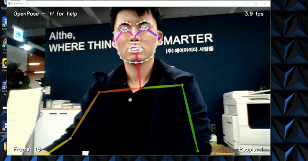

<p align="center">
    
    <br>
    <sup>Authors <a Demo</a></sup>
</p>

## How to install Openpose on Ubuntu

#### 1.  Go to the Anaconda downloads page https://www.anaconda.com/downloads and get the Python 3.6 version.
Then run Anaconda
Update your base Anaconda packages
``` conda update conda
conda update anaconda
conda update python
conda update --all
```

#### 2. Create a Python "virtual environment"
```
conda create --name dinhson
```

#### 3. Install protobu
Root: /data/dinhson/
```
sudo apt-get install autoconf automake libtool curl make g++ unzip -y
git clone https://github.com/google/protobuf.git
cd protobuf
git submodule update --init --recursive
./autogen.sh
./configure
make
make check
sudo make install
sudo ldconfig
```
#### 4. Install CMake GUI
```
sudo apt purge cmake-qt-gui
sudo apt-get install qtbase5-dev
```

Download CMake from the website , unzip it and go inside that folder. 
```
wget https://github.com/Kitware/CMake/releases/download/v3.17.2/cmake-3.17.2.tar.gz
tar -xvzf cmake-3.17.2.tar.gz

cd cmake-3.17.2
./bootstrap
make -j4
make install
```
#### 5. Install Openpose, Caffe
Root: /dinhson/
```
git clone https://github.com/CMU-Perceptual-Computing-Lab/openpose

cd openpose
sudo bash ./scripts/ubuntu/install_deps.sh  ## Prerequisites
sudo apt install caffe-cuda

sudo apt-get install libopencv-dev


sudo apt-get install cmake-qt-gui
cmake-gui
cd build
make -j`nproc`

cd python
make -j4
```
Then, demo: https://github.com/CMU-Perceptual-Computing-Lab/openpose/blob/master/doc/quick_start.md#quick-start


## Citation
Please cite these papers in your publications if it helps your research. Most of OpenPose is based on `[8765346]`. In addition, the hand and face keypoint detectors are a combination of `[8765346]` and `[Simon et al. 2017]` (the face detector was trained using the same procedure than the hand detector).

    @article{8765346,
      author = {Z. {Cao} and G. {Hidalgo Martinez} and T. {Simon} and S. {Wei} and Y. A. {Sheikh}},
      journal = {IEEE Transactions on Pattern Analysis and Machine Intelligence},
      title = {OpenPose: Realtime Multi-Person 2D Pose Estimation using Part Affinity Fields},
      year = {2019}
    }

    @inproceedings{simon2017hand,
      author = {Tomas Simon and Hanbyul Joo and Iain Matthews and Yaser Sheikh},
      booktitle = {CVPR},
      title = {Hand Keypoint Detection in Single Images using Multiview Bootstrapping},
      year = {2017}
    }

    @inproceedings{cao2017realtime,
      author = {Zhe Cao and Tomas Simon and Shih-En Wei and Yaser Sheikh},
      booktitle = {CVPR},
      title = {Realtime Multi-Person 2D Pose Estimation using Part Affinity Fields},
      year = {2017}
    }

    @inproceedings{wei2016cpm,
      author = {Shih-En Wei and Varun Ramakrishna and Takeo Kanade and Yaser Sheikh},
      booktitle = {CVPR},
      title = {Convolutional pose machines},
      year = {2016}
    }

Links to the papers:

- OpenPose: Realtime Multi-Person 2D Pose Estimation using Part Affinity Fields:
    - [IEEE TPAMI](https://ieeexplore.ieee.org/document/8765346)
    - [ArXiv](https://arxiv.org/abs/1812.08008)
- [Hand Keypoint Detection in Single Images using Multiview Bootstrapping](https://arxiv.org/abs/1704.07809)
- [Realtime Multi-Person 2D Pose Estimation using Part Affinity Fields](https://arxiv.org/abs/1611.08050)
- [Convolutional Pose Machines](https://arxiv.org/abs/1602.00134)


## License
OpenPose is freely available for free non-commercial use, and may be redistributed under these conditions. Please, see the [license](LICENSE) for further details. Interested in a commercial license? Check this [FlintBox link](https://cmu.flintbox.com/#technologies/b820c21d-8443-4aa2-a49f-8919d93a8740). For commercial queries, use the `Contact` section from the [FlintBox link](https://cmu.flintbox.com/#technologies/b820c21d-8443-4aa2-a49f-8919d93a8740) and also send a copy of that message to [Yaser Sheikh](mailto:yaser@cs.cmu.edu).
